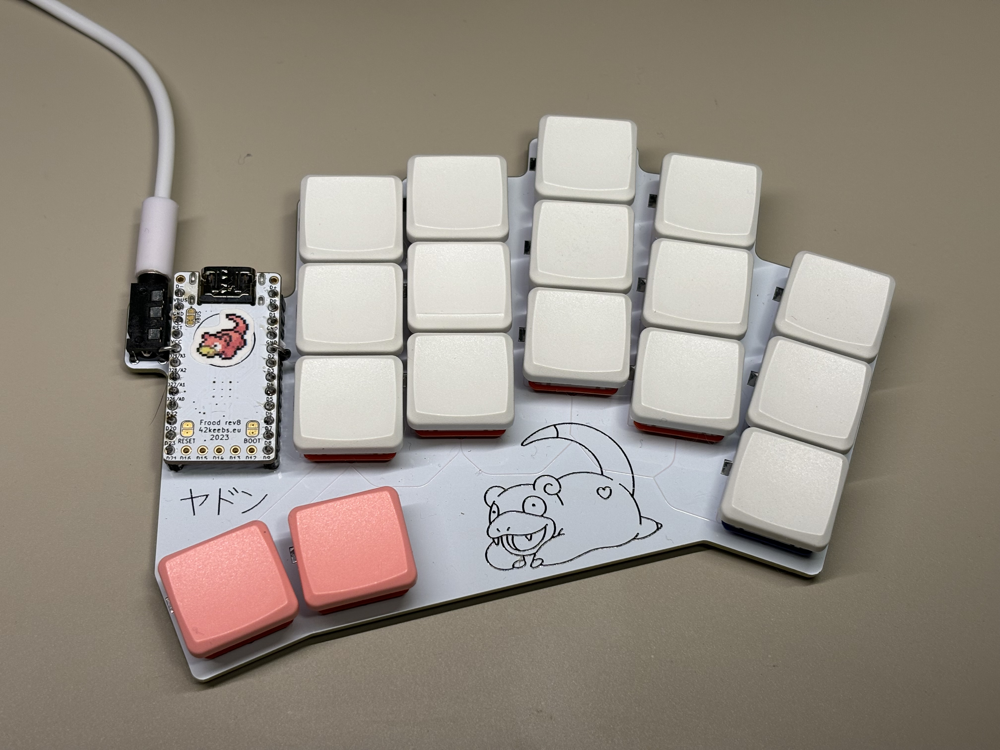
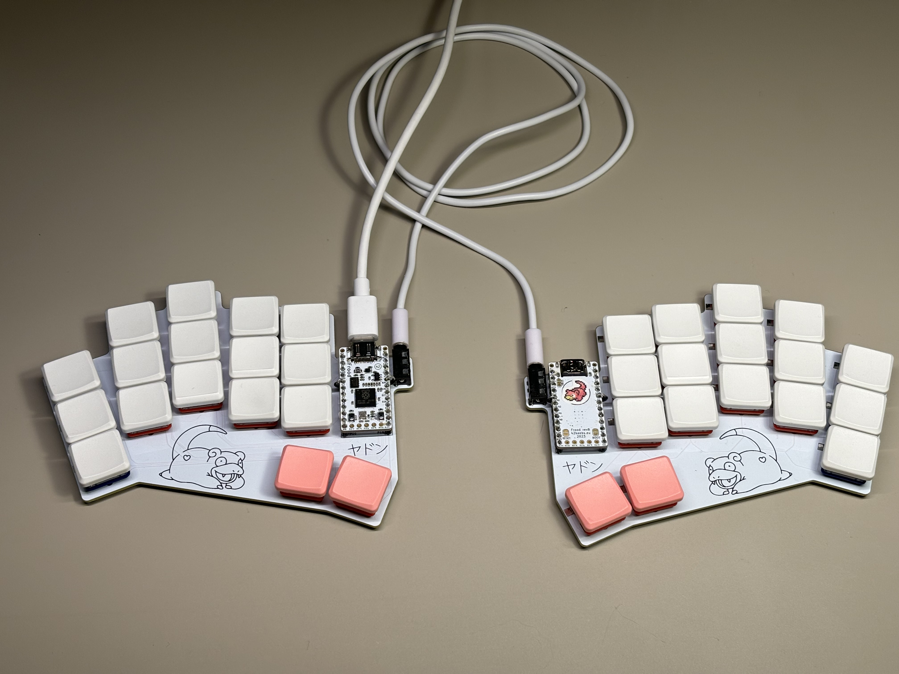

# Slowpoke (ヤドン)
Slowpoke (ヤドン) is a 34-key split keyboard.

Features:
* choc spacing
* Pro Micro compatible
* supports Kailh hotswap sockets
* reversible PCB

 

## Thanks
* [@tapioki](https://github.com/tapioki) for [Architeuthis dux](https://github.com/tapioki/cephalopoda/tree/main/Architeuthis%20dux) which heavily inspired this keyboard
* FlatFootFox for [a great series of articles about designing a keyboard with Ergogen and KiCad](https://flatfootfox.com/ergogen-introduction/)

## Changelog
### 0.1.0
The initial version of the keyboard.

This version has a routing bug that requires switching pins `P02` and `P21` so that the TRRS socket is routed to the `P02` and the inner column is routed to `P21`.

See [how to fix routing](docs/routing-fix.md).
